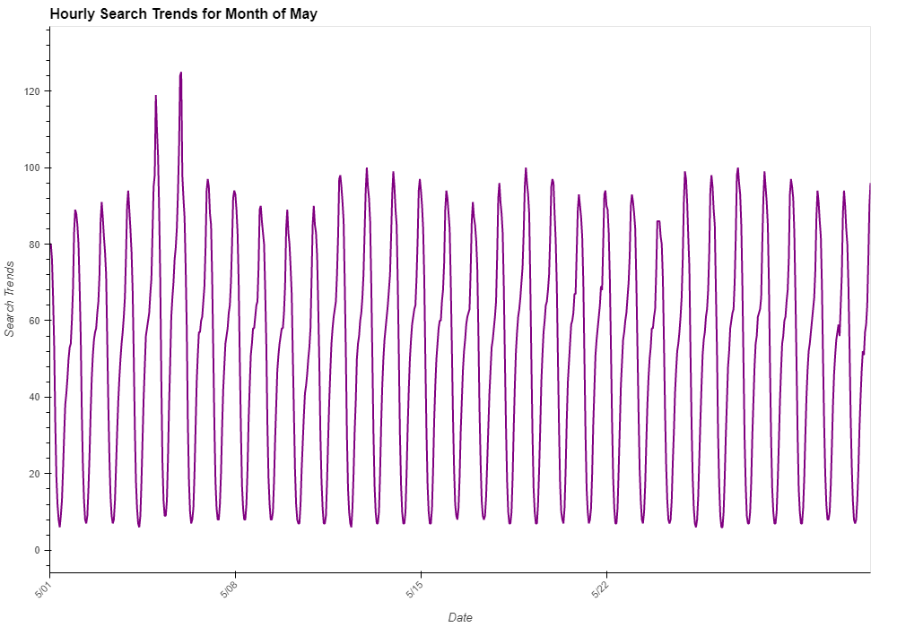

# Forecasting-Trends

# # Module 11 Time Series Data

This project was created using Google Colab, A cloud based IDE. The Google Colab link can be found [here](https://colab.research.google.com/drive/12rXQ7t-keDkf0wXtod8Ay0uv08DAUfHY?usp=sharing)

The purpose of this assesment was to use datat to find patterns between Hourly Google Search Trends and Sales for MercadoLibre. Machine Learning is used to forecast future trends. Below are some of the findings.

## During the Month of May, the Search Trends incresed which was inline with the comapnys earnings report 

.png)

## Most of the traffic occurs between 21:00 and 03:00 and then cools off between 05:00 and 10:00

.png)

## The search trends does increase during winter (weeks 40 through 52)
.png)
.png)

.png)
.png)
.png)
.png)

.png)

## When the search traffic declines, so does the stock price. It also appears that the long term trend in the close price is increasing even though the traffic is not consistently increasing and is remaining reasonably steady.

 According to the data, there is a slight negative correlation between stock volatility and search trends, which may indicate that higher search traffic will slightly decrease the stock volatility.

## The peak revenue days are Monday, Tuesday and Wednesdays

---

Based on the forecast information generated above, Daily sales have been steadily increasing. It is forecatsed that we will sell at least 1773 units in the next quarter. It is likely however that we will better with the model forecasting that we will sell between 1945 and 2116 units.

----